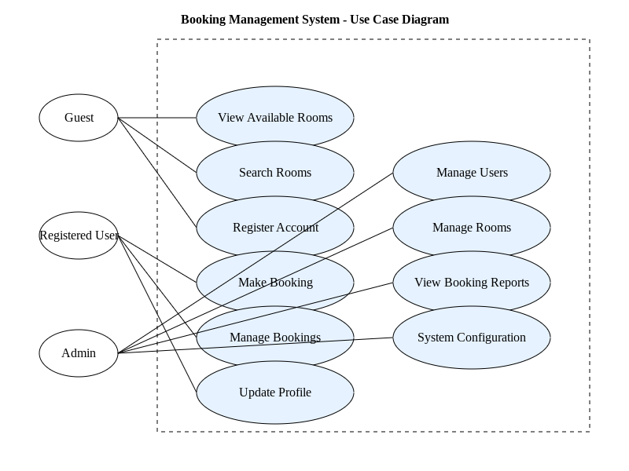

# Requirement Analysis in Software Development

## Project Overview

This repository documents a comprehensive requirement analysis project for a booking management system. It serves as a practical exploration of software requirement analysis techniques, methodologies, and best practices in the software development lifecycle (SDLC).

The project aims to:
- Demonstrate systematic requirement gathering
- Showcase detailed documentation practices
- Provide insights into translating business needs into technical specifications
- Illustrate the critical role of requirement analysis in successful software development

Through a step-by-step approach, this repository will walk through the process of analyzing, documenting, and visualizing requirements for a complex software system, emphasizing clarity, precision, and structured thinking.

## Project Goals

- Master requirement analysis methodologies
- Create industry-standard requirement documentation
- Develop skills in functional and non-functional requirement identification
- Practice visual representation of system requirements
- Establish clear acceptance criteria

## What is Requirement Analysis?

Requirement Analysis is a critical phase in the Software Development Life Cycle (SDLC) that serves as the foundation for successful software project delivery. It is a systematic process of identifying, documenting, validating, and managing the needs and expectations of stakeholders for a proposed software solution.

### Key Aspects of Requirement Analysis

1. **Purpose**
   Requirement Analysis bridges the gap between business stakeholders and technical teams by:
   - Capturing precise business needs
   - Defining clear project scope
   - Establishing a shared understanding of project objectives
   - Minimizing misunderstandings and potential project failures

2. **Types of Requirements**

   a) **Functional Requirements**
   - Describe specific behaviors and functions of the system
   - Define what the system must do
   - Specify user interactions, system processes, and expected outputs
   - Example: "The booking system must allow users to search and reserve available rooms"

   b) **Non-Functional Requirements**
   - Define system qualities and performance characteristics
   - Address system constraints, performance, security, and usability
   - Example: "The system must handle concurrent bookings from 100 users simultaneously"

3. **Requirement Analysis Process**

   - **Requirement Gathering**
     - Conduct stakeholder interviews
     - Distribute questionnaires
     - Observe existing processes
     - Review business documentation

   - **Requirement Documentation**
     - Create detailed requirement specifications
     - Use visual aids like use case diagrams
     - Write clear, unambiguous descriptions
     - Prioritize requirements

   - **Requirement Validation**
     - Review requirements with stakeholders
     - Ensure alignment with business goals
     - Identify and resolve conflicts
     - Obtain formal approval

4. **Importance in SDLC**
   - Reduces project risks
   - Prevents costly changes in later stages
   - Provides a clear roadmap for development
   - Ensures customer satisfaction
   - Facilitates more accurate project estimation

5. **Challenges**
   - Incomplete or changing stakeholder requirements
   - Communication barriers
   - Balancing technical feasibility with business needs
   - Managing scope creep

### Best Practices

- Maintain clear and consistent communication
- Use visual modeling techniques
- Document requirements in detail
- Involve stakeholders throughout the process
- Be prepared to iterate and refine requirements

## Why is Requirement Analysis Important?

Requirement Analysis is a pivotal phase in the Software Development Life Cycle (SDLC) that directly impacts the success of a software project. Here are the key reasons why it is critically important:

### 1. Risk Mitigation and Cost Reduction

Requirement Analysis serves as a proactive approach to identifying and addressing potential project risks early in the development process. By thoroughly understanding and documenting requirements upfront:
- Potential misunderstandings are identified and resolved before development begins
- Costly changes and rework are minimized
- The cost of fixing errors increases exponentially as the project progresses
  - In early stages (requirements phase): Near-zero cost
  - During design: 10x more expensive
  - During development: 100x more expensive
  - After deployment: 1000x more expensive

### 2. Alignment of Business Goals and Technical Implementation

Requirement Analysis ensures that the software solution precisely meets the strategic objectives of the organization:
- Translates business needs into technical specifications
- Creates a common language between stakeholders and development teams
- Ensures that the final product delivers tangible business value
- Provides a clear roadmap that aligns technical capabilities with business strategies
- Helps prioritize features based on business impact and user needs

### 3. Enhanced Stakeholder Satisfaction

A comprehensive requirement analysis process directly contributes to stakeholder satisfaction by:
- Establishing clear expectations
- Reducing ambiguity and misunderstandings
- Providing transparency in the development process
- Enabling early feedback and iterations
- Ensuring that the final product meets or exceeds stakeholder requirements
- Building trust through collaborative and inclusive requirement gathering

### 4. Improved Project Planning and Estimation

Requirement Analysis provides the foundation for accurate project planning:
- Enables more precise time and resource estimation
- Helps in creating realistic project timelines
- Identifies potential technical challenges early
- Supports better allocation of development resources
- Provides a basis for creating detailed project scope and deliverables
- Facilitates more accurate budgeting and resource planning

### 5. Quality Assurance and Testing Strategy

A well-documented requirement analysis directly supports the quality assurance process:
- Serves as a baseline for creating comprehensive test cases
- Enables more thorough and targeted testing
- Provides clear acceptance criteria for validating software functionality
- Helps in identifying potential edge cases and system behaviors
- Supports the development of a robust testing strategy aligned with business requirements

By investing time and effort in a thorough requirement analysis, organizations can significantly increase the likelihood of project success, reduce development costs, and deliver software solutions that truly meet business and user needs.

## Key Activities in Requirement Analysis

Requirement Analysis encompasses several critical activities that ensure comprehensive and accurate capture of project requirements. Here's a detailed breakdown of the key activities:

### 1. Requirement Gathering

Requirement gathering is the initial phase of collecting information about the project's needs and expectations.

- **Stakeholder Identification**
  - Identify all potential stakeholders (users, customers, managers, technical teams)
  - Determine their roles and levels of influence
  - Create a stakeholder communication plan

- **Data Collection Techniques**
  - Conduct one-on-one interviews
  - Organize focus group discussions
  - Distribute questionnaires and surveys
  - Observe current business processes
  - Review existing documentation and system artifacts
  - Facilitate requirement workshops

- **Information Sources**
  - Business leaders and executives
  - End-users and potential system users
  - Domain experts
  - Existing system documentation
  - Organizational process assets

### 2. Requirement Elicitation

Requirement elicitation involves extracting and uncovering detailed requirements from stakeholders.

- **Probing and Discovery**
  - Ask open-ended and targeted questions
  - Use techniques like the "5 Whys" to understand underlying needs
  - Explore explicit and implicit requirements
  - Identify potential unstated requirements

- **Elicitation Techniques**
  - Contextual inquiry
  - Prototyping
  - Scenario analysis
  - Mind mapping
  - Use case modeling
  - User story development

- **Challenges and Mitigation**
  - Handle conflicting stakeholder requirements
  - Manage communication barriers
  - Address knowledge gaps
  - Clarify ambiguous or vague requirements

### 3. Requirement Documentation

Requirement documentation involves formally capturing and organizing the gathered requirements.

- **Documentation Components**
  - Create a Software Requirements Specification (SRS) document
  - Define functional and non-functional requirements
  - Establish clear, measurable acceptance criteria
  - Prioritize requirements
  - Assign unique identifiers to each requirement

- **Documentation Best Practices**
  - Use clear, concise language
  - Avoid technical jargon
  - Be specific and unambiguous
  - Include rationale for requirements
  - Ensure traceability
  - Use templates and standardized formats

- **Documentation Tools**
  - Requirements management software
  - Collaboration platforms
  - Diagramming tools (e.g., Draw.io)
  - Version control systems

### 4. Requirement Analysis and Modeling

Requirement analysis involves analyzing, organizing, and modeling the collected requirements.

- **Requirement Classification**
  - Categorize requirements (functional, non-functional)
  - Identify dependencies and relationships
  - Assess feasibility and impact

- **Modeling Techniques**
  - Create use case diagrams
  - Develop process flow diagrams
  - Design state transition diagrams
  - Construct data flow diagrams
  - Build entity-relationship models

- **Analysis Activities**
  - Identify potential conflicts
  - Resolve requirement inconsistencies
  - Evaluate technical feasibility
  - Assess performance and scalability implications

### 5. Requirement Validation

Requirement validation ensures the accuracy, completeness, and alignment of requirements.

- **Validation Techniques**
  - Requirement review sessions
  - Walkthrough meetings
  - Prototyping
  - Simulation
  - Automated requirement checking tools

- **Validation Criteria**
  - Completeness
  - Consistency
  - Correctness
  - Feasibility
  - Testability
  - Traceability

- **Stakeholder Approval**
  - Obtain formal sign-off
  - Document any changes or compromises
  - Maintain a requirements traceability matrix
  - Establish a change management process

Also, by systematically executing these key activities, requirement analysts can ensure a comprehensive, accurate, and well-defined set of requirements that form the foundation of a successful software development project.

# Requirement Analysis in Software Development

[... Previous sections remain the same ...]

## Types of Requirements

Requirements in software development are typically categorized into two primary types: Functional and Non-functional Requirements. Each plays a crucial role in defining the complete behavior and quality attributes of a software system.

### Functional Requirements

Functional requirements specify the specific behaviors, functions, and features that a system must perform. They describe what the system should do in response to particular inputs and define the system's core functionality.

**Functional Requirements for Booking Management System**:

1. **User Registration and Authentication**
   - The system must allow users to create a new account
   - Users must be able to log in using email and password
   - Implement password reset functionality
   - Support social media login options (optional)

2. **Booking Management**
   - Users must be able to search for available rooms/spaces
   - System must allow users to select date and time ranges
   - Provide ability to make, modify, and cancel bookings
   - Generate unique booking confirmation numbers
   - Send email confirmations for bookings

3. **Search and Filtering**
   - Enable filtering of rooms by:
     * Capacity
     * Amenities
     * Price range
     * Availability
   - Implement advanced search capabilities
   - Display search results with detailed room information

4. **Payment Processing**
   - Support multiple payment methods
   - Calculate total booking cost
   - Generate invoices
   - Process refunds for cancellations
   - Integrate with secure payment gateways

5. **Reservation Management**
   - Allow administrators to manage all bookings
   - Provide dashboard for booking overview
   - Support manual booking creation for admin users
   - Generate reports on booking statistics

### Non-Functional Requirements

Non-functional requirements define the system's quality attributes, constraints, and performance characteristics. They describe how the system should behave and define the overall user experience and system performance.

**Non-Functional Requirements for Booking Management System**:

1. **Performance**
   - System must handle at least 100 concurrent users
   - Page load time should be under 2 seconds
   - Search results must be returned within 500 milliseconds
   - Support peak booking times without performance degradation

2. **Security**
   - Implement SSL/TLS encryption for all data transmissions
   - Store passwords using strong hashing algorithms
   - Comply with GDPR and data protection regulations
   - Implement multi-factor authentication
   - Log all system access and critical actions
   - Protect against common web vulnerabilities (SQL injection, XSS)

3. **Usability**
   - Develop responsive design for mobile and desktop
   - Ensure WCAG 2.1 accessibility compliance
   - Provide intuitive user interface
   - Support multiple languages
   - Implement clear error messages and validation
   - Maximum of 3 clicks to complete a booking

4. **Reliability**
   - System availability of 99.9% uptime
   - Automatic backup of booking data every 4 hours
   - Implement error logging and monitoring
   - Graceful error handling with user-friendly messages
   - Support system recovery in case of failures

5. **Scalability**
   - Design system to support future expansion
   - Allow addition of new room types without major redesign
   - Support horizontal scaling of infrastructure
   - Accommodate increasing number of users and bookings

6. **Compatibility**
   - Compatible with major web browsers (Chrome, Firefox, Safari, Edge)
   - Support integration with external calendar systems
   - Compatible with iOS and Android mobile devices
   - Support RESTful API for potential future integrations

By clearly defining both functional and non-functional requirements, the development team can create a comprehensive blueprint for the booking management system that meets both user needs and quality standards.

## Use Case Diagrams

### What are Use Case Diagrams?

Use Case Diagrams are visual representations in the Unified Modeling Language (UML) that capture the functional requirements of a system. They illustrate the interactions between system actors (users or external systems) and the various use cases (functions) within the system.

### Benefits of Use Case Diagrams

- Provide a high-level view of system functionality
- Clearly define system boundaries
- Identify key actors and their interactions
- Facilitate communication between stakeholders
- Serve as a basis for detailed requirement specifications
- Help in understanding system scope and requirements

### Booking Management System Use Case Diagram

#### Actors

1. **Guest**
   - Can view available rooms
   - Search rooms
   - Register for an account

2. **Registered User**
   - Inherits guest capabilities
   - Can make bookings
   - Manage personal bookings
   - Update profile information

3. **Admin**
   - Manage user accounts
   - Manage room inventories
   - View and generate booking reports
   - Configure system settings

#### Use Case Descriptions

**Guest Use Cases:**
- **View Available Rooms**: Browse room options without logging in
- **Search Rooms**: Apply filters to find specific room types
- **Register Account**: Create a new user profile

**Registered User Use Cases:**
- **Make Booking**: Select and reserve rooms
- **Manage Bookings**: View, modify, or cancel existing bookings
- **Update Profile**: Modify personal information

**Admin Use Cases:**
- **Manage Users**: Add, remove, or modify user accounts
- **Manage Rooms**: Add, update, or remove room inventories
- **View Booking Reports**: Generate and analyze booking statistics
- **System Configuration**: Adjust system-wide settings

### Creating Use Case Diagrams

When creating use case diagrams:
- Identify all potential actors
- List all system functions from each actor's perspective
- Keep use cases concise and focused
- Use clear, descriptive names
- Show relationships and interactions
- Validate with stakeholders

Use Case Diagrams are a powerful tool in requirement analysis, providing a clear, visual representation of system functionality and user interactions.

# Requirement Analysis in Software Development

[... Previous sections remain the same ...]

## Acceptance Criteria

### What are Acceptance Criteria?

Acceptance Criteria are specific, testable conditions that a software product must meet to be accepted by a stakeholder or customer. They define the boundaries of a user story or feature, providing clear guidelines for when a requirement is considered successfully implemented.

### Importance of Acceptance Criteria

- **Clarity and Precision**
  - Eliminate ambiguity in requirements
  - Provide a clear definition of "done"
  - Ensure shared understanding among team members

- **Validation and Testing**
  - Serve as a basis for creating test cases
  - Enable objective assessment of feature completion
  - Facilitate quality assurance processes

- **Stakeholder Alignment**
  - Bridge the gap between business requirements and technical implementation
  - Ensure alignment with customer expectations
  - Provide a mechanism for stakeholder sign-off

### Example: Booking Checkout Feature Acceptance Criteria

**User Story**: As a registered user, I want to complete a room booking and checkout process seamlessly.

**Functional Acceptance Criteria:**

1. **User Authentication**
   - Given a registered user is logged in
   - When navigating to the checkout page
   - Then user's personal information should be pre-filled

2. **Room Selection Validation**
   - Given a user has selected a room
   - When proceeding to checkout
   - Then the system must:
     * Confirm room availability for selected dates
     * Display accurate room pricing
     * Show total cost including any additional fees

3. **Payment Processing**
   - Given a user enters valid payment information
   - When submitting payment
   - Then the system must:
     * Process payment through secure gateway
     * Generate a unique booking confirmation number
     * Send a confirmation email within 5 minutes
     * Update room availability in real-time

4. **Error Handling**
   - Given insufficient payment details or unavailable room
   - When attempting to complete booking
   - Then the system must:
     * Display clear, specific error messages
     * Prevent booking completion
     * Retain user's entered information
     * Provide clear instructions for resolution

5. **Booking Confirmation**
   - Given a successful booking
   - When checkout is complete
   - Then the system must:
     * Display a comprehensive booking summary
     * Provide a downloadable receipt
     * Allow immediate booking modification or cancellation
     * Update user's booking history

**Non-Functional Acceptance Criteria:**

1. **Performance**
   - Checkout process must complete within 10 seconds
   - Support concurrent bookings from multiple users
   - Maintain system responsiveness during peak hours

2. **Security**
   - Encrypt all payment and personal information
   - Comply with PCI-DSS security standards
   - Implement fraud detection mechanisms

3. **User Experience**
   - Provide a responsive design for mobile and desktop
   - Ensure clear, readable fonts and color contrast
   - Implement intuitive navigation during checkout

Acceptance Criteria are a crucial component of requirement analysis, providing a clear, measurable guide for feature implementation and validation.